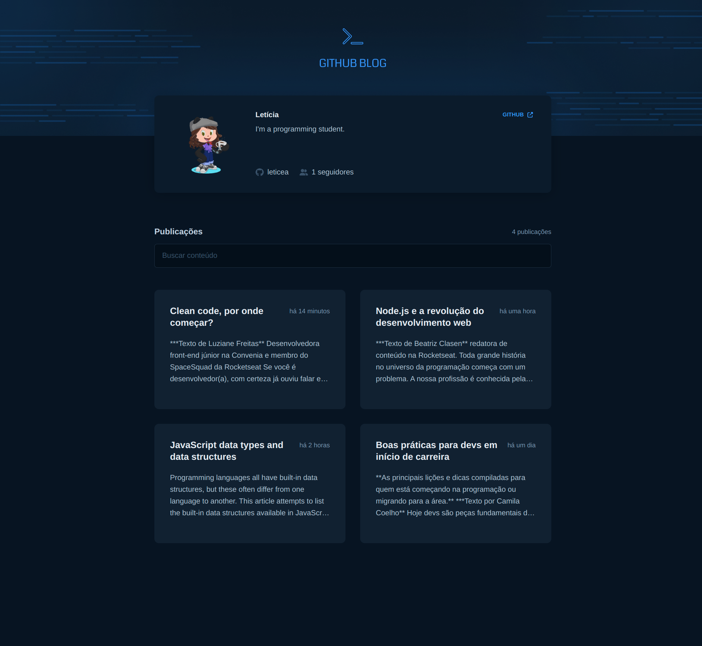
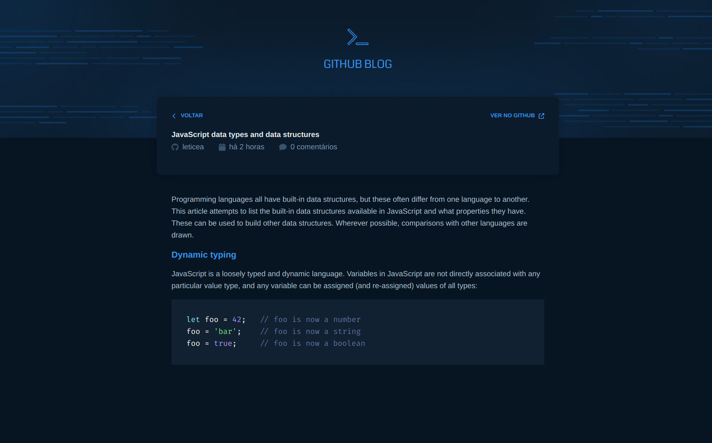

  <a href="#-tecnologias">Tecnologias</a>&nbsp;&nbsp;&nbsp;|&nbsp;&nbsp;&nbsp;
  <a href="#-projeto">Projeto</a>&nbsp;&nbsp;&nbsp;|&nbsp;&nbsp;&nbsp;
  <a href="#-como-rodar">Como rodar</a>&nbsp;&nbsp;&nbsp;|&nbsp;&nbsp;&nbsp;
  <a href="#-como-contribuir">Como contribuir</a>&nbsp;&nbsp;&nbsp;

 

# Github Blog

## 🚀 Tecnologias

Esse projeto foi desenvolvido com as seguintes tecnologias:

- [Npm](https://www.npmjs.com/) - 8.19.2
- [Vite](https://vitejs.dev/) - ^4.4.5
- [TypeScript](https://www.typescriptlang.org/) - ^4.9.3
- [React](https://react.dev/) - ^18.2.0,
- [React-Hook-Form](https://react-hook-form.com/) - ^7.45.4
- [React-Router-Dom](https://reactrouter.com/en/main) - ^6.15.0
- [Axios](https://github.com/axios/axios) - ^1.4.0
- [Zod](https://zod.dev/) - ^3.21.4
- [Moment](https://momentjs.com/docs/) - ^2.29.4
- [React-Markdown](https://github.com/remarkjs/react-markdown) - ^8.0.7
- [React-Syntax-Highlighter](https://github.com/react-syntax-highlighter/react-syntax-highlighter) - ^15.5.0
- [Styled Components](https://styled-components.com/) - ^6.0.5
- [Font Awesome](https://fontawesome.com/docs/web/use-with/react/) - ^6.4.2

## 💻 Projeto

Projeto de Front-end de React de uma aplicação que utiliza a API do GitHub para buscar issues de um repositório, mostra os dados do perfil e exibe elas como uma página de blog.

- Módulo ReactJS do Ignite na plataforma da [Rocketseat](https://www.rocketseat.com.br/).

  

  

## ⚙️ Como Rodar

- Clone o projeto.
- Entre na pasta do projeto e rode 'npm install' (use 'yarn add' se for essa a sua configuração).
- Crie um arquivo .env na raiz do projeto com as configurações VITE_GITHUB_USERNAME=seu_username e VITE_GITHUB_REPONAME=nome_do_repositório, lembrando que o repositório deve ser criado com as issues.
- npm run dev (para rodar o projeto na porta indicada).

## 🤔 Como contribuir

- Faça um fork desse repositório;
- Cria uma branch com a sua feature: `git checkout -b minha-feature`;
- Faça commit das suas alterações: `git commit -m 'feat: Minha nova feature'`;
- Faça push para a sua branch: `git push origin minha-feature`.

Depois que o merge da sua pull request for feito, você pode deletar a sua branch.

## 📝 Licença

Esse projeto está sob a licença MIT.
